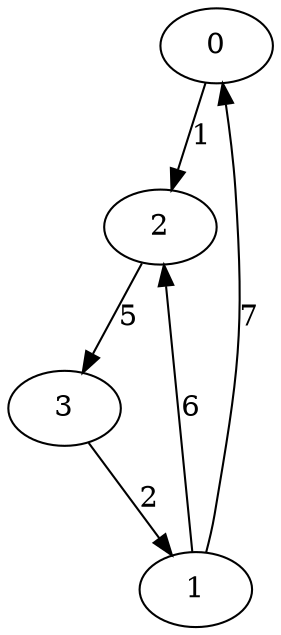

## The story behind this post

Recently I've received `+10` karma on StackOverflow. I was curious for what question or answer and clicked to check this. It appeared
to be a [**seven-year-old** answer](https://stackoverflow.com/a/4526639/330471) about a Floyd-Warshall algorithm. I was surprised both of my bad English back those days and the very small value the answer had. So I've revised it and here it is -- the brand-new version!

## The definitions

Let us have a graph, described by matrix `D`, where `D[i][j]` is the length of the edge `(i -> j)` *(from graph's vertex with index `i` to the vertex with index `j`)*.

Matrix `D` has the size of `N * N`, where `N` is a total number of vertices in a graph because we can reach the maximum of paths by connecting each graph's vertex to each other.

Also, we'll need matrix `R`, where we will store the vertices of the shortest paths (`R[i][j]` contains the index of a vertex, where the shortest path from vertex `i` to vertex `j` lies).

Matrix `R` has the same size as `D`.

The Floyd-Warshall algorithm performs these steps:

1. initialize the matrix of all the paths between any two pairs of vertices in a graph with the edge's end vertex *(this is important since this value will be used for path reconstruction)*

2. for each pair of connected vertices *(read: for each edge `(u -> v)`)*, `u` and `v`, find the vertex, which forms shortest path between them: if the vertex `k` defines two valid edges `(u -> k)` and `(k -> v)` *(if they are present in the graph)*, which are together shorter than path `(u -> v)`, then assume the shortest path between `u` and `v` lies through `k`; set the shortest pivot point in matrix `R` for edge `(u -> v)` to be the corresponding pivot point for edge `(u -> k)`

But how do we read the matrix `D`?

<!--more-->

## Inputs

Take sample graph:

<!--

-->


<div class="info">
In <em>GraphViz</em> it would be described as follows:

```
digraph G {
    0->2 [label = "1"];
    2->3 [label = "5"];
    3->1 [label = "2"];
    1->2 [label = "6"];
    1->0 [label = "7"];
}
```
</div>

We first create a two-dimensional array of size `4` *(since there are exactly `4` vertices in our graph)*.

We initialize its main diagonal *(the items, whose indices are equal, for ex. `G[0, 0]`, `G[1, 1]`, etc.)* with zeros, because
the shortest path from vertex to itself has the length `0` and the other elements with a very large number *(to indicate there is no edge or an infinitely long edge between them)*. The defined elements, corresponding to graph's edges, we fill with edges' lengths:

```csharp
int N = 4;
int[,] D = new int[N, N];

for (int i = 0; i < N; i++) {
    for (int t = 0; t < N; t++) {
        if (i == t) {
            D[i, t] = 0;
        } else {
            D[i, t] = 9999;
        }
    }
}
```

And let's say we initialize our `D` matrix by hand:

```csharp
D[0, 2] = 1;
D[1, 0] = 7;
D[1, 2] = 6;
D[2, 3] = 5;
D[3, 1] = 2;
```

## The algorithm itself

Now that we are on a same page with definitions, algorithm can be implemented like this:

```csharp
// Initialise the routes matrix R, essentially saying "the shortest path from u to v is straight"
for (int i = 0; i < N; i++) {
    for (int t = 0; t < N; t++) {
        R[i][t] = t;
    }
}

// Floyd-Warshall algorithm:
for (int k = 0; k < N; k++) {
    for (int u = 0; u < N; u++) {
        for (int v = 0; v < N; v++) {
            // check if the shortest path from "u" to "v" is actually through "k"
            if (D[u, v] > D[u, k] + D[k, v]) {
                D[u, v] = D[u, k] + D[k, v];
                R[u, v] = R[u, k];
            }
        }
    }
}
```

Let's "animate" this algorithm in few steps for the sample graph from above:

### Initial state

* the `D` matrix contains distance from vertex `u` to vertex `v`, where both `u` and `v` are indexes of those vertices in a graph and `u` is the index of a row and `v` is the index of the column in any of the matrices `R` and `D`
* path from `u` to `u` is thought to be infinitely long meaning we do not allow this type of paths
* in matrix `R` we define the shortest path from `u` to `v` to lie through `v`

<div class="row space-between">
    <div class="col">
        <table>
            <tbody>
                <tr>
                    <td rowspan="2"></td>
                    <td colspan="5" class="center head">D</td>
                </tr>
                <tr>
                    <td class="head">0</td>
                    <td class="head">1</td>
                    <td class="head">2</td>
                    <td class="head">3</td>
                </tr>
                <tr>
                    <td class="head">0</td>
                    <td>0</td>
                    <td>&infin;</td>
                    <td>1</td>
                    <td>&infin;</td>
                </tr>
                <tr>
                    <td class="head">1</td>
                    <td>7</td>
                    <td>0</td>
                    <td>6</td>
                    <td>&infin;</td>
                </tr>
                <tr>
                    <td class="head">2</td>
                    <td>&infin;</td>
                    <td>&infin;</td>
                    <td>0</td>
                    <td>5</td>
                </tr>
                <tr>
                    <td class="head">3</td>
                    <td>&infin;</td>
                    <td>2</td>
                    <td>&infin;</td>
                    <td>0</td>
                </tr>
            </tbody>
        </table>
    </div>
    <div class="col">
        <table>
            <tbody>
                <tr>
                    <td rowspan="2"></td>
                    <td colspan="5" class="center head">R</td>
                </tr>
                <tr>
                    <td class="head">0</td>
                    <td class="head">1</td>
                    <td class="head">2</td>
                    <td class="head">3</td>
                </tr>
                <tr>
                    <td class="head">0</td>
                    <td>0</td>
                    <td>1</td>
                    <td>2</td>
                    <td>3</td>
                </tr>
                <tr>
                    <td class="head">1</td>
                    <td>0</td>
                    <td>1</td>
                    <td>2</td>
                    <td>3</td>
                </tr>
                <tr>
                    <td class="head">2</td>
                    <td>0</td>
                    <td>1</td>
                    <td>2</td>
                    <td>3</td>
                </tr>
                <tr>
                    <td class="head">3</td>
                    <td>0</td>
                    <td>1</td>
                    <td>2</td>
                    <td>3</td>
                </tr>
            </tbody>
        </table>
    </div>
</div>

### Step 1

We try to find the shortest paths to each of the neighbours of vertex `0` *(first row of each table)*. For each neighbour *(call it `v`)* we check if path from `0` to `v` directly is shorter than through some vertex `k`. If the path through `k` is shorter - we reflect that in matrix `R` and update the total distance to that vertex in matrix `D`.

For vertex `0` we will check each combination of:

**paths from `0` to `0`:**

* `0 -> 0 -> 1`
* `0 -> 0 -> 0`
* `0 -> 0 -> 2`
* `0 -> 0 -> 3`

**paths from `0` to `1`:**

* `0 -> 1 -> 0`
* `0 -> 1 -> 1`
* `0 -> 1 -> 2`
* `0 -> 1 -> 3`

**paths from `0` to `2`:**

* `0 -> 2 -> 0`
* `0 -> 2 -> 1`
* `0 -> 2 -> 2`
* `0 -> 2 -> 3`

**paths from `0` to `3`:**

* `0 -> 3 -> 0`
* `0 -> 3 -> 1`
* `0 -> 3 -> 2`
* `0 -> 3 -> 3`

As you can see, there are lots of invalid paths here - those which either do not exist or do not make sense. Examples are: any paths from `0` to `0` (since we forbid those), paths which do not exist, paths to any vertex through source vertex.

We could easily reduce the amount of the steps performed by the algorithm by throwing few `if` conditions to check for those cases.

But let's first finish animating this step: there are very few valid paths amongst `N * N === 16` of those we've checked *(there are `16` checks only for paths starting at `0`!)*.

There is a check for a non-existing path `0 -> 3` and it is compared to a indirect path, through `2`:

1. there is no direct path `0 -> 3`; we think of such path as infinitely long
2. `0 -> 2` has length `1` and `2 -> 3` has length `5`, the total length is `6`, which is better than infinitely long path

So there are two changes in our matrices:

<div class="row space-between">
    <div class="col">
        <table>
            <tbody>
                <tr>
                    <td rowspan="2"></td>
                    <td colspan="5" class="center head">D</td>
                </tr>
                <tr>
                    <td class="head">0</td>
                    <td class="head">1</td>
                    <td class="head">2</td>
                    <td class="head">3</td>
                </tr>
                <tr>
                    <td class="head">0</td>
                    <td>0</td>
                    <td>&infin;</td>
                    <td>1</td>
                    <td class="change">6</td>
                </tr>
                <tr>
                    <td class="head">1</td>
                    <td>7</td>
                    <td>0</td>
                    <td>6</td>
                    <td>&infin;</td>
                </tr>
                <tr>
                    <td class="head">2</td>
                    <td>&infin;</td>
                    <td>&infin;</td>
                    <td>0</td>
                    <td>5</td>
                </tr>
                <tr>
                    <td class="head">3</td>
                    <td>&infin;</td>
                    <td>2</td>
                    <td>&infin;</td>
                    <td>0</td>
                </tr>
            </tbody>
        </table>
    </div>
    <div class="col">
        <table>
            <tbody>
                <tr>
                    <td rowspan="2"></td>
                    <td colspan="5" class="center head">R</td>
                </tr>
                <tr>
                    <td class="head">0</td>
                    <td class="head">1</td>
                    <td class="head">2</td>
                    <td class="head">3</td>
                </tr>
                <tr>
                    <td class="head">0</td>
                    <td>0</td>
                    <td>1</td>
                    <td>2</td>
                    <td class="change">2</td>
                </tr>
                <tr>
                    <td class="head">1</td>
                    <td>0</td>
                    <td>1</td>
                    <td>2</td>
                    <td>3</td>
                </tr>
                <tr>
                    <td class="head">2</td>
                    <td>0</td>
                    <td>1</td>
                    <td>2</td>
                    <td>3</td>
                </tr>
                <tr>
                    <td class="head">3</td>
                    <td>0</td>
                    <td>1</td>
                    <td>2</td>
                    <td>3</td>
                </tr>
            </tbody>
        </table>
    </div>
</div>

### Step 2

For vertex `1` we will check each combination of:

**paths from `1` to `0`:**

* `1 -> 0 -> 1`
* `1 -> 0 -> 0`
* `1 -> 0 -> 2`
* `1 -> 0 -> 3`

**paths from `1` to `1`:**

* `1 -> 1 -> 0`
* `1 -> 1 -> 1`
* `1 -> 1 -> 2`
* `1 -> 1 -> 3`

**paths from `1` to `2`:**

* `1 -> 2 -> 0`
* `1 -> 2 -> 1`
* `1 -> 2 -> 2`
* `1 -> 2 -> 3`

**paths from `1` to `3`:**

* `1 -> 3 -> 0`
* `1 -> 3 -> 1`
* `1 -> 3 -> 2`
* `1 -> 3 -> 3`

This case is more interesting - there are two direct paths starting at vertex `1` *(namely `1 -> 0` and `1 -> 2`)* and there are two indirect paths from `1` *(`1 -> 0 -> 2` and `1 -> 2 -> 3`)*.

Let's see each combination:

1. `1 -> 2` has length `6`
2. `1 -> 0` has length `7` and `0 -> 2` has length `1`, the indirect path `1 -> 0 -> 2` has length `8`

The first path is shorter, so the path from `1` to `2` will be direct and no changes to the matrices will be made for its case.

1. there is no path from `1` to `3` directly, so its length is `inf`
2. `1 -> 2` has length `6` and `2 -> 3` has length `5`, the total is `11` which is infinitely better than infinity

For this path the distance in matrix `D` will be updated to `11` and the matrix `R` will be changed to reflect the fact that the shortest path from `1` to `3` lies through `2`.

<div class="row space-between">
    <div class="col">
        <table>
            <tbody>
                <tr>
                    <td rowspan="2"></td>
                    <td colspan="5" class="center head">D</td>
                </tr>
                <tr>
                    <td class="head">0</td>
                    <td class="head">1</td>
                    <td class="head">2</td>
                    <td class="head">3</td>
                </tr>
                <tr>
                    <td class="head">0</td>
                    <td>0</td>
                    <td>&infin;</td>
                    <td>1</td>
                    <td>&infin;</td>
                </tr>
                <tr>
                    <td class="head">1</td>
                    <td>7</td>
                    <td>0</td>
                    <td>6</td>
                    <td class="change">11</td>
                </tr>
                <tr>
                    <td class="head">2</td>
                    <td>&infin;</td>
                    <td>&infin;</td>
                    <td>0</td>
                    <td>5</td>
                </tr>
                <tr>
                    <td class="head">3</td>
                    <td>&infin;</td>
                    <td>2</td>
                    <td>&infin;</td>
                    <td>0</td>
                </tr>
            </tbody>
        </table>
    </div>
    <div class="col">
        <table>
            <tbody>
                <tr>
                    <td rowspan="2"></td>
                    <td colspan="5" class="center head">R</td>
                </tr>
                <tr>
                    <td class="head">0</td>
                    <td class="head">1</td>
                    <td class="head">2</td>
                    <td class="head">3</td>
                </tr>
                <tr>
                    <td class="head">0</td>
                    <td>0</td>
                    <td>1</td>
                    <td>2</td>
                    <td>3</td>
                </tr>
                <tr>
                    <td class="head">1</td>
                    <td>0</td>
                    <td>1</td>
                    <td>2</td>
                    <td class="change">2</td>
                </tr>
                <tr>
                    <td class="head">2</td>
                    <td>0</td>
                    <td>1</td>
                    <td>2</td>
                    <td>3</td>
                </tr>
                <tr>
                    <td class="head">3</td>
                    <td>0</td>
                    <td>1</td>
                    <td>2</td>
                    <td>3</td>
                </tr>
            </tbody>
        </table>
    </div>
</div>

### Step 3

For vertex `2` we will check each combination of:

**paths from `2` to `0`:**

* `2 -> 0 -> 1`
* `2 -> 0 -> 0`
* `2 -> 0 -> 2`
* `2 -> 0 -> 3`

**paths from `2` to `1`:**

* `2 -> 1 -> 0`
* `2 -> 1 -> 1`
* `2 -> 1 -> 2`
* `2 -> 1 -> 3`

**paths from `2` to `2`:**

* `2 -> 2 -> 0`
* `2 -> 2 -> 1`
* `2 -> 2 -> 2`
* `2 -> 2 -> 3`

**paths from `2` to `3`:**

* `2 -> 3 -> 0`
* `2 -> 3 -> 1`
* `2 -> 3 -> 2`
* `2 -> 3 -> 3`

This case is similar to the previous one:

1. there is no path from `2` to `1` directly, so its length is `inf`
2. `2 -> 3` has length `5` and `3 -> 1` has length `2`, the total is `7` which is shorter than infinity

The distance in matrix `D` will be updated to `7` and the shortest in-between vertex in matrix `R` will be changed to `3`.

<div class="row space-between">
    <div class="col">
        <table>
            <tbody>
                <tr>
                    <td rowspan="2"></td>
                    <td colspan="5" class="center head">D</td>
                </tr>
                <tr>
                    <td class="head">0</td>
                    <td class="head">1</td>
                    <td class="head">2</td>
                    <td class="head">3</td>
                </tr>
                <tr>
                    <td class="head">0</td>
                    <td>0</td>
                    <td>&infin;</td>
                    <td>1</td>
                    <td>&infin;</td>
                </tr>
                <tr>
                    <td class="head">1</td>
                    <td>7</td>
                    <td>0</td>
                    <td>6</td>
                    <td>11</td>
                </tr>
                <tr>
                    <td class="head">2</td>
                    <td>&infin;</td>
                    <td class="change">7</td>
                    <td>0</td>
                    <td>5</td>
                </tr>
                <tr>
                    <td class="head">3</td>
                    <td>&infin;</td>
                    <td>2</td>
                    <td>&infin;</td>
                    <td>0</td>
                </tr>
            </tbody>
        </table>
    </div>
    <div class="col">
        <table>
            <tbody>
                <tr>
                    <td rowspan="2"></td>
                    <td colspan="5" class="center head">R</td>
                </tr>
                <tr>
                    <td class="head">0</td>
                    <td class="head">1</td>
                    <td class="head">2</td>
                    <td class="head">3</td>
                </tr>
                <tr>
                    <td class="head">0</td>
                    <td>0</td>
                    <td>1</td>
                    <td>2</td>
                    <td>3</td>
                </tr>
                <tr>
                    <td class="head">1</td>
                    <td>0</td>
                    <td>1</td>
                    <td>2</td>
                    <td>3</td>
                </tr>
                <tr>
                    <td class="head">2</td>
                    <td>0</td>
                    <td class="change">3</td>
                    <td>2</td>
                    <td>3</td>
                </tr>
                <tr>
                    <td class="head">3</td>
                    <td>0</td>
                    <td>1</td>
                    <td>2</td>
                    <td>2</td>
                </tr>
            </tbody>
        </table>
    </div>
</div>

### Step 4

For vertex `3` we will check each combination of:

**paths from `3` to `0`:**

* `3 -> 0 -> 1`
* `3 -> 0 -> 0`
* `3 -> 0 -> 2`
* `3 -> 0 -> 3`

**paths from `3` to `1`:**

* `3 -> 1 -> 0`
* `3 -> 1 -> 1`
* `3 -> 1 -> 2`
* `3 -> 1 -> 3`

**paths from `3` to `2`:**

* `3 -> 2 -> 0`
* `3 -> 2 -> 1`
* `3 -> 2 -> 2`
* `3 -> 2 -> 3`

**paths from `3` to `3`:**

* `3 -> 3 -> 0`
* `3 -> 3 -> 1`
* `3 -> 3 -> 2`
* `3 -> 3 -> 3`

This case is the last one. It is similar to the previous two.

For path `3 -> 0`:

1. there is no path from `3` to `0` directly, so its length is `inf`
2. `3 -> 1` has length `2` and `1 -> 0` has length `7`, the total is `9` which is better than infinity

For path `3 -> 2`:

1. there is no path from `3` to `2` directly, so its length is `inf`
2. `3 -> 1` has length `2` and `1 -> 2` has length `6`, the total is `8` which is better than infinity

Both matrices `R` and `D` will be updated to reflect that:

<div class="row space-between">
    <div class="col">
        <table>
            <tbody>
                <tr>
                    <td rowspan="2"></td>
                    <td colspan="5" class="center head">D</td>
                </tr>
                <tr>
                    <td class="head">0</td>
                    <td class="head">1</td>
                    <td class="head">2</td>
                    <td class="head">3</td>
                </tr>
                <tr>
                    <td class="head">0</td>
                    <td>0</td>
                    <td>&infin;</td>
                    <td>1</td>
                    <td>&infin;</td>
                </tr>
                <tr>
                    <td class="head">1</td>
                    <td>7</td>
                    <td>0</td>
                    <td>6</td>
                    <td>11</td>
                </tr>
                <tr>
                    <td class="head">2</td>
                    <td>&infin;</td>
                    <td>7</td>
                    <td>0</td>
                    <td>5</td>
                </tr>
                <tr>
                    <td class="head">3</td>
                    <td class="change">9</td>
                    <td>2</td>
                    <td class="change">8</td>
                    <td>0</td>
                </tr>
            </tbody>
        </table>
    </div>
    <div class="col">
        <table>
            <tbody>
                <tr>
                    <td rowspan="2"></td>
                    <td colspan="5" class="center head">R</td>
                </tr>
                <tr>
                    <td class="head">0</td>
                    <td class="head">1</td>
                    <td class="head">2</td>
                    <td class="head">3</td>
                </tr>
                <tr>
                    <td class="head">0</td>
                    <td>0</td>
                    <td>1</td>
                    <td>2</td>
                    <td>3</td>
                </tr>
                <tr>
                    <td class="head">1</td>
                    <td>0</td>
                    <td>1</td>
                    <td>2</td>
                    <td>3</td>
                </tr>
                <tr>
                    <td class="head">2</td>
                    <td>0</td>
                    <td>3</td>
                    <td>2</td>
                    <td>3</td>
                </tr>
                <tr>
                    <td class="head">3</td>
                    <td class="change">1</td>
                    <td>1</td>
                    <td class="change">1</td>
                    <td>2</td>
                </tr>
            </tbody>
        </table>
    </div>
</div>

## Path reconstruction

In order to reconstruct the path from vertex `u` to vertex `v`, you need follow the elements of matrix `R`, effectively going "through" each vertex:

```csharp
    List<Int32> Path = new List<Int32>();

    while (start != end)
    {
        Path.Add(start);

        start = R[start, end];
    }

    Path.Add(end);
```

Let's follow this logic in steps again, "animating" the algorithm. For instance, the longest path in this graph possible, from `0` to `1`:

1. `R[0, 1] == 

## Summary

The whole code could be wrapped in a couple of methods:

```csharp
using System;
using System.Collections.Generic;

public class FloydWarshallPathFinder {
    private int N;
    private int[,] D;
    private int[,] R;

    public FloydWarshallPathFinder(int NumberOfVertices, int[,] EdgesLengths) {
        N = NumberOfVertices;
        D = EdgesLengths;
        R = null;
    }

    public int[,] FindAllPaths() {
        R = new int[N, N];

        for (int i = 0; i < N; i++)
        {
            for (int t = 0; t < N; t++)
            {
                R[i, t] = t;
            }
        }

        for (int k = 0; k < N; k++)
        {
            for (int v = 0; v < N; v++)
            {
                for (int u = 0; u < N; u++)
                {
                    if (D[u, k] + D[k, v] < D[u, v])
                    {
                        D[u, v] = D[u, k] + D[k, v];
                        R[u, v] = R[u, k];
                    }
                }
            }
        }

        return R;
    }

    public List<Int32> FindShortestPath(int start, int end) {
        if (R == null) {
            FindAllPaths();
        }

        List<Int32> Path = new List<Int32>();

        while (start != end)
        {
            Path.Add(start);

            start = R[start, end];
        }

        Path.Add(end);

        return Path;
    }
}

public class MainClass
{
    public static void Main()
    {
        int N = 4;
        int[,] D = new int[N, N];

        for (int i = 0; i < N; i++) {
            for (int t = 0; t < N; t++) {
                if (i == t) {
                    D[i, t] = 0;
                } else {
                    D[i, t] = 9999;
                }
            }
        }

        D[0, 2] = 1;
        D[1, 0] = 7;
        D[1, 2] = 6;
        D[2, 3] = 5;
        D[3, 1] = 2;

        FloydWarshallPathFinder pathFinder = new FloydWarshallPathFinder(N, D);

        int start = 0;
        int end = 1;

        Console.WriteLine("Path: {0}", String.Join(" -> ", pathFinder.FindShortestPath(start, end).ToArray()));
    }
}
```

You can read 'bout this algorithm on [wikipedia][1] and get some data structures generated automatically [here][2]


  [1]: http://en.wikipedia.org/wiki/Floyd%E2%80%93Warshall_algorithm
  [2]: http://quickgraph.codeplex.com/
