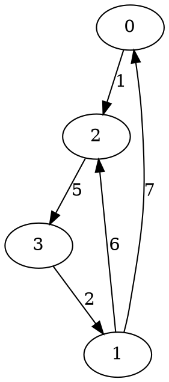

## The story behind this post

Recently I've received `+10` karma on StackOverflow. I was interested for what question or answer and clicked to check this. It appeared
to be a [**seven-year-old** answer](https://stackoverflow.com/a/4526639/330471) about Floyd-Warshall algorithm. I was surprised both of my bad English back those days and the very small sense the answer had. So I've rewritten it and here's the brand-new version!

## The definitions

Let us have a graph, described by matrix `D`, where `D[i][j]` is the length of edge `(i -> j)` *(from graph's vertex with index `i` to the vertex with index `j`)*.

Matrix `D` has the size of `N * N`, where `N` is total number of vertices in graph, because we can reach the maximum of paths by connecting each graph's vertex to each other.

Also we'll need matrix `R`, where we will store shortest paths (`R[i][j]` contains the index of a next vertex in the shortest path, starting at vertex `i` and ending at vertex `j`).

Matrix `R` has the same size as `D`.

The Floyd-Warshall algorithm performs these steps:

1. initialize the matrix of all the paths between any two pairs or vertices in a graph with the edge's end vertex *(this is important, since this value will be used for path reconstruction)*

2. for each pair of connected vertices *(read: for each edge `(u -> v)`)*, `u` and `v`, find the vertex, which forms shortest path between them: if the vertex `k` defines two valid edges `(u -> k)` and `(k -> v)` *(if they are present in the graph)*, which are together shorter than path `(u -> v)`, then assume the shortest path between `u` and `v` lies through `k`; set the shortest pivot point in matrix `R` for edge `(u -> v)` to be the corresponding pivot point for edge `(u -> k)`

But how do we read the matrix `D`?

<!--more-->

## Inputs

Let us have a graph:

<!--

-->

In <em>GraphViz</em> it would be described as follows:


digraph G {
    0->2 [label = "1"];
    2->3 [label = "5"];
    3->1 [label = "2"];
    1->2 [label = "6"];
    1->0 [label = "7"];
}


We first create a two-dimensional array of size `4` *(since there are exactly `4` vertices in our graph)*.

We initialize its main diagonal *(the items, whose indices are equal, for ex. `G[0, 0]`, `G[1, 1]`, etc.)* with zeros, because
the shortest path from vertex to itself has the length `0` and the other elements with a very large number *(to indicate there is no edge or an infinitely long edge between them)*. The defined elements, corresponding to graph's edges, we fill with edges' lengths:


int N = 4;
int[,] D = new int[N, N];

for (int i = 0; i < N; i++) {
    for (int t = 0; t < N; t++) {
        if (i == t) {
            D[i, t] = 0;
        } else {
            D[i, t] = 9999;
        }
    }
}

D[0, 2] = 1;
D[1, 0] = 7;
D[1, 2] = 6;
D[2, 3] = 5;
D[3, 1] = 2;


## The algorithm itself

Now that we are on a same page with definitions, algorithm can be implemented like this:


// Initialise the routes matrix R
for (int i = 0; i < N; i++) {
    for (int t = 0; t < N; t++) {
        R[i][t] = t;
    }
}

// Floyd-Warshall algorithm:
for (int k = 0; k < N; k++) {
    for (int u = 0; u < N; u++) {
        for (int v = 0; v < N; v++) {
            if (D[u, v] > D[u, k] + D[k, v]) {
                D[u, v] = D[u, k] + D[k, v];
                R[u, v] = R[u, k];
            }
        }
    }
}


After the algorithm run, the matrix `R` will be filled with vertices' indices, describing shortest paths between them.

## Path reconstruction

In order to reconstruct the path from vertex `u` to vertex `v`, you need follow the elements of matrix `R`:


    List<Int32> Path = new List<Int32>();

    while (start != end)
    {
        Path.Add(start);

        start = R[start, end];
    }

    Path.Add(end);


## Summary

The whole code could be wrapped in a couple of methods:


using System;
using System.Collections.Generic;

public class FloydWarshallPathFinder {
    private int N;
    private int[,] D;
    private int[,] R;

    public FloydWarshallPathFinder(int NumberOfVertices, int[,] EdgesLengths) {
        N = NumberOfVertices;
        D = EdgesLengths;
        R = null;
    }

    public int[,] FindAllPaths() {
        R = new int[N, N];

        for (int i = 0; i < N; i++)
        {
            for (int t = 0; t < N; t++)
            {
                R[i, t] = t;
            }
        }

        for (int k = 0; k < N; k++)
        {
            for (int v = 0; v < N; v++)
            {
                for (int u = 0; u < N; u++)
                {
                    if (D[u, k] + D[k, v] < D[u, v])
                    {
                        D[u, v] = D[u, k] + D[k, v];
                        R[u, v] = R[u, k];
                    }
                }
            }
        }

        return R;
    }

    public List<Int32> FindShortestPath(int start, int end) {
        if (R == null) {
            FindAllPaths();
        }

        List<Int32> Path = new List<Int32>();

        while (start != end)
        {
            Path.Add(start);

            start = R[start, end];
        }

        Path.Add(end);

        return Path;
    }
}

public class MainClass
{
    public static void Main()
    {
        int N = 4;
        int[,] D = new int[N, N];

        for (int i = 0; i < N; i++) {
            for (int t = 0; t < N; t++) {
                if (i == t) {
                    D[i, t] = 0;
                } else {
                    D[i, t] = 9999;
                }
            }
        }

        D[0, 2] = 1;
        D[1, 0] = 7;
        D[1, 2] = 6;
        D[2, 3] = 5;
        D[3, 1] = 2;

        FloydWarshallPathFinder pathFinder = new FloydWarshallPathFinder(N, D);

        int start = 0;
        int end = 1;

        Console.WriteLine("Path: {0}", String.Join(" -> ", pathFinder.FindShortestPath(start, end).ToArray()));
    }
}


You can read 'bout this algorithm on [wikipedia][1] and get some data structures generated automatically [here][2]

  [1]: http://en.wikipedia.org/wiki/Floyd%E2%80%93Warshall_algorithm
  [2]: http://quickgraph.codeplex.com/
