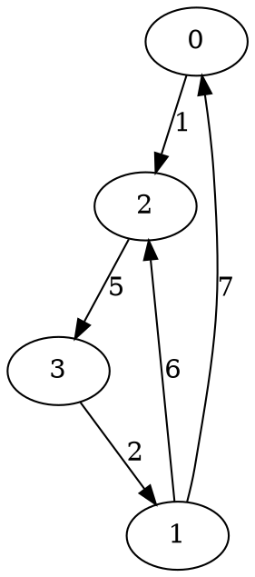
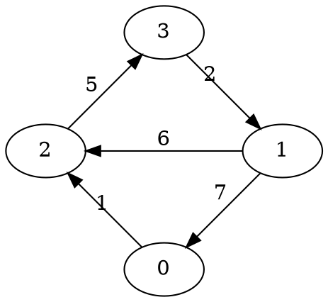

<style>
    table td {
        padding: 0.25em 1em;
        text-align: center;
    }
</style>

## The story behind this post

Recently I've received `+10` karma on StackOverflow. I was curious for what question or answer and clicked to check this. It appeared
to be a [**seven-year-old** answer](https://stackoverflow.com/a/4526639/330471) about a Floyd-Warshall algorithm. I was surprised with both my bad English (back those days...) and the very small value the answer had. So I've revised it and here it is -- the brand-new version!

## The definitions

Let us have a graph, described by matrix `D`, where `D[i][j]` is the length of the edge `(i -> j)` *(from graph's vertex with index `i` to the vertex with index `j`)*.

Matrix `D` has the size of `N * N`, where `N` is a total number of vertices in a graph because we can reach the maximum of paths by connecting each graph's vertex to each other.

Also, we'll need matrix `R`, where we will store the vertices of the shortest paths (`R[i][j]` contains the index of a vertex, where the shortest path from vertex `i` to vertex `j` lies).

Matrix `R` has the same size as `D`.

The Floyd-Warshall algorithm performs these steps:

1. initialize the matrix of all the paths between any two pairs of vertices in a graph with the edge's end vertex *(this is important since this value will be used for path reconstruction)*

2. for each pair of connected vertices *(read: for each edge `(u -> v)`)*, `u` and `v`, find the vertex, which forms shortest path between them: if the vertex `k` defines two valid edges `(u -> k)` and `(k -> v)` *(if they are present in the graph)*, which are together shorter than path `(u -> v)`, then assume the shortest path between `u` and `v` lies through `k`; set the shortest pivot point in matrix `R` for edge `(u -> v)` to be the corresponding pivot point for edge `(u -> k)`

But how do we read the matrix `D`?

<!--more-->

## Inputs

Take sample graph:

<!--

-->


In <em>GraphViz</em> it would be described as follows:



We first create a two-dimensional array of size `4` *(since there are exactly `4` vertices in our graph)*.

We initialize its main diagonal *(the items, whose indices are equal, for ex. `G[0, 0]`, `G[1, 1]`, etc.)* with zeros, because
the shortest path from vertex to itself has the length `0` and the other elements with a very large number *(to indicate there is no edge or an infinitely long edge between them)*. The defined elements, corresponding to graph's edges, we fill with edges' lengths:

```csharp
int N = 4;
int[,] D = new int[N, N];

for (int i = 0; i < N; i++) {
    for (int t = 0; t < N; t++) {
        if (i == t) {
            D[i, t] = 0;
        } else {
            D[i, t] = 9999;
        }
    }
}
```

And let's say we initialize our `D` matrix by hand:

```csharp
D[0, 2] = 1;
D[1, 0] = 7;
D[1, 2] = 6;
D[2, 3] = 5;
D[3, 1] = 2;
```

## The algorithm itself

Now that we are on a same page with definitions, algorithm can be implemented like this:

```csharp
int[,] R = new int[N, N];

// Initialise the routes matrix R, essentially saying "the shortest path from u to v is straight"
for (int i = 0; i < N; i++) {
    for (int t = 0; t < N; t++) {
        R[i, t] = t;
    }
}

// Floyd-Warshall algorithm; note the order of iterators DOES matter:
for (int k = 0; k < N; k++) {
    for (int u = 0; u < N; u++) {
        for (int v = 0; v < N; v++) {
            // check if the shortest path from "u" to "v" is actually through "k"
            if (D[u, v] > D[u, k] + D[k, v]) {
                D[u, v] = D[u, k] + D[k, v];
                R[u, v] = R[u, k];
            }
        }
    }
}
```

Let's "animate" this algorithm in few steps for the sample graph from above:

### Initial state

* the `D` matrix contains distance from vertex `u` to vertex `v`, where both `u` and `v` are indexes of those vertices in a graph and `u` is the index of a row and `v` is the index of the column in any of the matrices `R` and `D`
* path from `u` to `u` is thought to be infinitely long meaning we do not allow this type of paths
* in matrix `R` we define the shortest path from `u` to `v` to lie through `v`

<div class="row space-between">
    <div class="col">
        <table>
            <tbody>
                <tr>
                    <td rowspan="2"></td>
                    <td colspan="5" class="center head">D</td>
                </tr>
                <tr>
                    <td class="head">0</td>
                    <td class="head">1</td>
                    <td class="head">2</td>
                    <td class="head">3</td>
                </tr>
                <tr>
                    <td class="head">0</td>
                    <td>0</td>
                    <td>&infin;</td>
                    <td>1</td>
                    <td>&infin;</td>
                </tr>
                <tr>
                    <td class="head">1</td>
                    <td>7</td>
                    <td>0</td>
                    <td>6</td>
                    <td>&infin;</td>
                </tr>
                <tr>
                    <td class="head">2</td>
                    <td>&infin;</td>
                    <td>&infin;</td>
                    <td>0</td>
                    <td>5</td>
                </tr>
                <tr>
                    <td class="head">3</td>
                    <td>&infin;</td>
                    <td>2</td>
                    <td>&infin;</td>
                    <td>0</td>
                </tr>
            </tbody>
        </table>
    </div>
    <div class="col">
        <table>
            <tbody>
                <tr>
                    <td rowspan="2"></td>
                    <td colspan="5" class="center head">R</td>
                </tr>
                <tr>
                    <td class="head">0</td>
                    <td class="head">1</td>
                    <td class="head">2</td>
                    <td class="head">3</td>
                </tr>
                <tr>
                    <td class="head">0</td>
                    <td>0</td>
                    <td>1</td>
                    <td>2</td>
                    <td>3</td>
                </tr>
                <tr>
                    <td class="head">1</td>
                    <td>0</td>
                    <td>1</td>
                    <td>2</td>
                    <td>3</td>
                </tr>
                <tr>
                    <td class="head">2</td>
                    <td>0</td>
                    <td>1</td>
                    <td>2</td>
                    <td>3</td>
                </tr>
                <tr>
                    <td class="head">3</td>
                    <td>0</td>
                    <td>1</td>
                    <td>2</td>
                    <td>3</td>
                </tr>
            </tbody>
        </table>
    </div>
</div>

### Step 1

We try to find the vertex which makes the **shorter** path through itself than the direct path between two vertices. E.g. for every vertex `k` we find the pair of vertices `u` and `v` where path `u -> v` is **longer** than the path `u -> k -> v`. If we found one - we will update the matrices `D` and `R`, correspondingly.

For vertex `k = 0` we will check each combination of:

**paths through `0` starting at `0`:**

* `0 -> 0` vs `0 -> 0 -> 0`
* `0 -> 1` vs `0 -> 0 -> 1`
* `0 -> 2` vs `0 -> 0 -> 2`
* `0 -> 3` vs `0 -> 0 -> 3`

**paths through `0` starting at `1`:**

* `1 -> 0` vs `1 -> 0 -> 0`
* `1 -> 1` vs `1 -> 0 -> 1`
* `1 -> 2` vs `1 -> 0 -> 2`
* `1 -> 3` vs `1 -> 0 -> 3`

**paths through `0` starting at `2`:**

* `2 -> 0` vs `2 -> 0 -> 0`
* `2 -> 1` vs `2 -> 0 -> 1`
* `2 -> 2` vs `2 -> 0 -> 2`
* `2 -> 3` vs `2 -> 0 -> 3`

**paths through `0` starting at `3`:**

* `3 -> 0` vs `3 -> 0 -> 0`
* `3 -> 1` vs `3 -> 0 -> 1`
* `3 -> 2` vs `3 -> 0 -> 2`
* `3 -> 3` vs `3 -> 0 -> 3`

As you can see, there are lots of invalid paths here - those which either do not exist or do not make sense. Examples are: paths which do not exist *(like `0 -> 3`)* and paths to any vertex through source vertex *(like `0 -> 0 -> 0` and `0 -> 0 -> (any)`)*.

We could easily reduce the amount of the steps performed by the algorithm by throwing few `if` conditions to check for those cases.

But let's first finish animating this step: there are very few valid paths amongst `N * N === 16` of those we've checked. And only one comparison: for path `1 -> 2` vs `1 -> 0 -> 2` we compare `6` *(direct)* and `7 + 1 = 8` *(`1 -> 0` and then `0 -> 2`)*.


<!--
digraph G {
    layout = "circo";

    0->2 [label = "1", color = "blue"];
    2->3 [label = "5"];
    3->1 [label = "2"];
    1->2 [label = "6", color = "green"];
    1->0 [label = "7", color = "blue"];
}
-->

So there are no changes in our matrices.

<div class="row space-between">
    <div class="col">
        <table>
            <tbody>
                <tr>
                    <td rowspan="2"></td>
                    <td colspan="5" class="center head">D</td>
                </tr>
                <tr>
                    <td class="head">0</td>
                    <td class="head">1</td>
                    <td class="head">2</td>
                    <td class="head">3</td>
                </tr>
                <tr>
                    <td class="head">0</td>
                    <td>0</td>
                    <td>&infin;</td>
                    <td>1</td>
                    <td>&infin;</td>
                </tr>
                <tr>
                    <td class="head">1</td>
                    <td>7</td>
                    <td>0</td>
                    <td>6</td>
                    <td>&infin;</td>
                </tr>
                <tr>
                    <td class="head">2</td>
                    <td>&infin;</td>
                    <td>&infin;</td>
                    <td>0</td>
                    <td>5</td>
                </tr>
                <tr>
                    <td class="head">3</td>
                    <td>&infin;</td>
                    <td>2</td>
                    <td>&infin;</td>
                    <td>0</td>
                </tr>
            </tbody>
        </table>
    </div>
    <div class="col">
        <table>
            <tbody>
                <tr>
                    <td rowspan="2"></td>
                    <td colspan="5" class="center head">R</td>
                </tr>
                <tr>
                    <td class="head">0</td>
                    <td class="head">1</td>
                    <td class="head">2</td>
                    <td class="head">3</td>
                </tr>
                <tr>
                    <td class="head">0</td>
                    <td>0</td>
                    <td>1</td>
                    <td>2</td>
                    <td>3</td>
                </tr>
                <tr>
                    <td class="head">1</td>
                    <td>0</td>
                    <td>1</td>
                    <td>2</td>
                    <td>3</td>
                </tr>
                <tr>
                    <td class="head">2</td>
                    <td>0</td>
                    <td>1</td>
                    <td>2</td>
                    <td>3</td>
                </tr>
                <tr>
                    <td class="head">3</td>
                    <td>0</td>
                    <td>1</td>
                    <td>2</td>
                    <td>3</td>
                </tr>
            </tbody>
        </table>
    </div>
</div>

### Step 2

For vertex `1` we will check each combination of:

**paths through `1` starting at `0`:**

* `0 -> 0` vs `0 -> 1 -> 0`
* `0 -> 1` vs `0 -> 1 -> 1`
* `0 -> 2` vs `0 -> 1 -> 2`
* `0 -> 3` vs `0 -> 1 -> 3`

**paths through `1` starting at `1`:**

* `1 -> 0` vs `1 -> 1 -> 0`
* `1 -> 1` vs `1 -> 1 -> 1`
* `1 -> 2` vs `1 -> 1 -> 2`
* `1 -> 3` vs `1 -> 1 -> 3`

**paths through `1` starting at `2`:**

* `2 -> 0` vs `2 -> 1 -> 0`
* `2 -> 1` vs `2 -> 1 -> 1`
* `2 -> 2` vs `2 -> 1 -> 2`
* `2 -> 3` vs `2 -> 1 -> 3`

**paths through `1` starting at `3`:**

* `3 -> 0` vs `3 -> 1 -> 0`
* `3 -> 1` vs `3 -> 1 -> 1`
* `3 -> 2` vs `3 -> 1 -> 2`
* `3 -> 3` vs `3 -> 1 -> 3`

This case is more interesting - there are more things to compare. Let's see each combination:

1. `3 -> 0` does not exist (`inf`)
2. `3 -> 1` has length `2` and `1 -> 0` has length `7`, the indirect path `3 -> 1 -> 0` has length `9`

Hence we will update matrices `D` and `R` reflecting that.

For path `3 -> 1 -> 2`:

1. there is no path from `3` to `2` directly, so its length is `inf`
2. `3 -> 1` has length `2` and `1 -> 2` has length `6`, the total is `8` which is infinitely better than infinity

Here are the updated matrices:

<div class="row space-between">
    <div class="col">
        <table>
            <tbody>
                <tr>
                    <td rowspan="2"></td>
                    <td colspan="5" class="center head">D</td>
                </tr>
                <tr>
                    <td class="head">0</td>
                    <td class="head">1</td>
                    <td class="head">2</td>
                    <td class="head">3</td>
                </tr>
                <tr>
                    <td class="head">0</td>
                    <td>0</td>
                    <td>&infin;</td>
                    <td>1</td>
                    <td>&infin;</td>
                </tr>
                <tr>
                    <td class="head">1</td>
                    <td>7</td>
                    <td>0</td>
                    <td>6</td>
                    <td>&infin;</td>
                </tr>
                <tr>
                    <td class="head">2</td>
                    <td>&infin;</td>
                    <td>&infin;</td>
                    <td>0</td>
                    <td>5</td>
                </tr>
                <tr>
                    <td class="head">3</td>
                    <td class="change">9</td>
                    <td>2</td>
                    <td class="change">8</td>
                    <td>0</td>
                </tr>
            </tbody>
        </table>
    </div>
    <div class="col">
        <table>
            <tbody>
                <tr>
                    <td rowspan="2"></td>
                    <td colspan="5" class="center head">R</td>
                </tr>
                <tr>
                    <td class="head">0</td>
                    <td class="head">1</td>
                    <td class="head">2</td>
                    <td class="head">3</td>
                </tr>
                <tr>
                    <td class="head">0</td>
                    <td>0</td>
                    <td>1</td>
                    <td>2</td>
                    <td>3</td>
                </tr>
                <tr>
                    <td class="head">1</td>
                    <td>0</td>
                    <td>1</td>
                    <td>2</td>
                    <td>3</td>
                </tr>
                <tr>
                    <td class="head">2</td>
                    <td>0</td>
                    <td>1</td>
                    <td>2</td>
                    <td>3</td>
                </tr>
                <tr>
                    <td class="head">3</td>
                    <td class="change">1</td>
                    <td>1</td>
                    <td class="change">1</td>
                    <td>3</td>
                </tr>
            </tbody>
        </table>
    </div>
</div>

### Step 3

For vertex `2` we will check each combination of:

**paths through `2` starting at `0`:**

* `0 -> 0` vs `0 -> 2 -> 0`
* `0 -> 1` vs `0 -> 2 -> 1`
* `0 -> 2` vs `0 -> 2 -> 2`
* `0 -> 3` vs `0 -> 2 -> 3`

**paths through `2` starting at `1`:**

* `1 -> 0` vs `1 -> 2 -> 0`
* `1 -> 1` vs `1 -> 2 -> 1`
* `1 -> 2` vs `1 -> 2 -> 2`
* `1 -> 3` vs `1 -> 2 -> 3`

**paths through `2` starting at `2`:**

* `2 -> 0` vs `2 -> 2 -> 0`
* `2 -> 1` vs `2 -> 2 -> 1`
* `2 -> 2` vs `2 -> 2 -> 2`
* `2 -> 3` vs `2 -> 2 -> 3`

**paths through `2` starting at `3`:**

* `3 -> 0` vs `3 -> 2 -> 0`
* `3 -> 1` vs `3 -> 2 -> 1`
* `3 -> 2` vs `3 -> 2 -> 2`
* `3 -> 3` vs `3 -> 2 -> 3`

The valid comparisons are:

* `0 -> 3` vs `0 -> 2 -> 3`
* `1 -> 3` vs `1 -> 2 -> 3`

In first case, we compare infinity (`0 -> 3`) to `1 + 5 == 6` (`0 -> 2` and then `2 -> 3`).
In second case we compare infinity again (`1 -> 3`) to `6 + 5 == 11` (`1 -> 2` and then `2 -> 3`).
In both cases we select the path through vertex `2`.

<div class="row space-between">
    <div class="col">
        <table>
            <tbody>
                <tr>
                    <td rowspan="2"></td>
                    <td colspan="5" class="center head">D</td>
                </tr>
                <tr>
                    <td class="head">0</td>
                    <td class="head">1</td>
                    <td class="head">2</td>
                    <td class="head">3</td>
                </tr>
                <tr>
                    <td class="head">0</td>
                    <td>0</td>
                    <td>&infin;</td>
                    <td>1</td>
                    <td class="change">6</td>
                </tr>
                <tr>
                    <td class="head">1</td>
                    <td>7</td>
                    <td>0</td>
                    <td>6</td>
                    <td class="change">11</td>
                </tr>
                <tr>
                    <td class="head">2</td>
                    <td>&infin;</td>
                    <td>&infin;</td>
                    <td>0</td>
                    <td>5</td>
                </tr>
                <tr>
                    <td class="head">3</td>
                    <td>9</td>
                    <td>2</td>
                    <td>8</td>
                    <td>0</td>
                </tr>
            </tbody>
        </table>
    </div>
    <div class="col">
        <table>
            <tbody>
                <tr>
                    <td rowspan="2"></td>
                    <td colspan="5" class="center head">R</td>
                </tr>
                <tr>
                    <td class="head">0</td>
                    <td class="head">1</td>
                    <td class="head">2</td>
                    <td class="head">3</td>
                </tr>
                <tr>
                    <td class="head">0</td>
                    <td>0</td>
                    <td>1</td>
                    <td>2</td>
                    <td class="change">2</td>
                </tr>
                <tr>
                    <td class="head">1</td>
                    <td>0</td>
                    <td>1</td>
                    <td>2</td>
                    <td class="change">2</td>
                </tr>
                <tr>
                    <td class="head">2</td>
                    <td>0</td>
                    <td>1</td>
                    <td>2</td>
                    <td>3</td>
                </tr>
                <tr>
                    <td class="head">3</td>
                    <td>1</td>
                    <td>1</td>
                    <td>1</td>
                    <td>3</td>
                </tr>
            </tbody>
        </table>
    </div>
</div>

### Step 4

For vertex `3` we will check each combination of:

**paths through `3` starting at `0`:**

* `0 -> 0` vs `0 -> 3 -> 0`
* `0 -> 1` vs `0 -> 3 -> 1`
* `0 -> 2` vs `0 -> 3 -> 2`
* `0 -> 3` vs `0 -> 3 -> 3`

**paths through `3` starting at `1`:**

* `1 -> 0` vs `1 -> 3 -> 0`
* `1 -> 1` vs `1 -> 3 -> 1`
* `1 -> 2` vs `1 -> 3 -> 2`
* `1 -> 3` vs `1 -> 3 -> 3`

**paths through `3` starting at `2`:**

* `2 -> 0` vs `2 -> 3 -> 0`
* `2 -> 1` vs `2 -> 3 -> 1`
* `2 -> 2` vs `2 -> 3 -> 2`
* `2 -> 3` vs `2 -> 3 -> 3`

**paths through `3` starting at `3`:**

* `3 -> 0` vs `3 -> 3 -> 0`
* `3 -> 1` vs `3 -> 3 -> 1`
* `3 -> 2` vs `3 -> 3 -> 2`
* `3 -> 3` vs `3 -> 3 -> 3`

This case is the last one. It is similar to the previous two. But please note that we are using the matrix values from the previous step.

For path `0 -> 1`:

1. direct path from `0` to `1` does not exist, take it as `inf`
2. shortest path from `0` to `3` *(whichever it is)* has length `6`; `3 -> 1` has length `2`; the total path has length `8` which is better than infinity


<!--
digraph G {
    layout = "circo";

    0->2 [label = "1", color = "blue"];
    2->3 [label = "5", color = "blue"];
    3->1 [label = "2", color = "blue"];
    1->2 [label = "6"];
    1->0 [label = "7"];
    0->1 [label = "∞", style = "dashed", color = "red"];
}
-->

For path `2 -> 0`:

1. direct path `2 -> 0` does not exist
2. the edge `2 -> 3` exists and has length `5`; path from `3` to `0` has length `9`; so the shortest path from `2` to `0` through `3` will have length `9 + 5 == 14`

For path `2 -> 1`:

1. there is no direct path `2 -> 1`
2. the path `2 -> 3` is `5` and `3 -> 1` is `2`, so `2 -> 3 -> 1` is `7`

Both matrices `R` and `D` will be updated to reflect that:

<div class="row space-between">
    <div class="col">
        <table>
            <tbody>
                <tr>
                    <td rowspan="2"></td>
                    <td colspan="5" class="center head">D</td>
                </tr>
                <tr>
                    <td class="head">0</td>
                    <td class="head">1</td>
                    <td class="head">2</td>
                    <td class="head">3</td>
                </tr>
                <tr>
                    <td class="head">0</td>
                    <td>0</td>
                    <td class="change">8</td>
                    <td>1</td>
                    <td>6</td>
                </tr>
                <tr>
                    <td class="head">1</td>
                    <td>7</td>
                    <td>0</td>
                    <td>6</td>
                    <td>11</td>
                </tr>
                <tr>
                    <td class="head">2</td>
                    <td class="change">14</td>
                    <td class="change">7</td>
                    <td>0</td>
                    <td>5</td>
                </tr>
                <tr>
                    <td class="head">3</td>
                    <td>9</td>
                    <td>2</td>
                    <td>8</td>
                    <td>0</td>
                </tr>
            </tbody>
        </table>
    </div>
    <div class="col">
        <table>
            <tbody>
                <tr>
                    <td rowspan="2"></td>
                    <td colspan="5" class="center head">R</td>
                </tr>
                <tr>
                    <td class="head">0</td>
                    <td class="head">1</td>
                    <td class="head">2</td>
                    <td class="head">3</td>
                </tr>
                <tr>
                    <td class="head">0</td>
                    <td>0</td>
                    <td class="change">2</td>
                    <td>2</td>
                    <td>2</td>
                </tr>
                <tr>
                    <td class="head">1</td>
                    <td>0</td>
                    <td>1</td>
                    <td>2</td>
                    <td>2</td>
                </tr>
                <tr>
                    <td class="head">2</td>
                    <td class="change">3</td>
                    <td class="change">3</td>
                    <td>2</td>
                    <td>3</td>
                </tr>
                <tr>
                    <td class="head">3</td>
                    <td>1</td>
                    <td>1</td>
                    <td>1</td>
                    <td>3</td>
                </tr>
            </tbody>
        </table>
    </div>
</div>

And then the algorithm is done.

## Path reconstruction

In order to reconstruct the path from vertex `u` to vertex `v`, you need follow the elements of matrix `R`, effectively going "through" each vertex:

```csharp
    List<Int32> Path = new List<Int32>();

    while (start != end) {
        Path.Add(start);

        start = R[start, end];
    }

    Path.Add(end);
```

Let's follow this logic in steps again, "animating" the algorithm. For instance, the longest path in this graph possible, from `0` to `1`:

0. `start = 0, end = 1`
1. `R[0, 1] == 2, start = 2, end = 1`
2. `R[2, 1] == 3, start = 3, end = 1`
3. `R[3, 1] == 1, start = 1, end = 1`

So the path from `0` to `1` is all the values the `start` variable takes *(except last)*, namely: `0 -> 2 -> 3`.

## Summary

The whole code could be wrapped in a couple of methods:

```csharp
using System;
using System.Collections.Generic;

public class FloydWarshallPathFinder {
    private int N;
    private int[,] D;
    private int[,] R;

    public FloydWarshallPathFinder(int NumberOfVertices, int[,] EdgesLengths) {
        N = NumberOfVertices;
        D = EdgesLengths;
        R = null;
    }

    public int[,] FindAllPaths() {
        R = new int[N, N];

        for (int i = 0; i < N; i++) {
            for (int t = 0; t < N; t++) {
                R[i, t] = t;
            }
        }

        for (int k = 0; k < N; k++) {
            for (int v = 0; v < N; v++) {
                for (int u = 0; u < N; u++) {
                    if (D[u, k] + D[k, v] < D[u, v]) {
                        D[u, v] = D[u, k] + D[k, v];
                        R[u, v] = R[u, k];
                    }
                }
            }
        }

        return R;
    }

    public List<Int32> FindShortestPath(int start, int end) {
        if (R == null) {
            FindAllPaths();
        }

        List<Int32> Path = new List<Int32>();

        while (start != end) {
            Path.Add(start);

            start = R[start, end];
        }

        Path.Add(end);

        return Path;
    }
}

public class MainClass {
    public static void Main() {
        int N = 4;
        int[,] D = new int[N, N];

        for (int i = 0; i < N; i++) {
            for (int t = 0; t < N; t++) {
                if (i == t) {
                    D[i, t] = 0;
                } else {
                    D[i, t] = 9999;
                }
            }
        }

        D[0, 2] = 1;
        D[1, 0] = 7;
        D[1, 2] = 6;
        D[2, 3] = 5;
        D[3, 1] = 2;

        FloydWarshallPathFinder pathFinder = new FloydWarshallPathFinder(N, D);

        int start = 0;
        int end = 1;

        Console.WriteLine("Path: {0}", String.Join(" -> ", pathFinder.FindShortestPath(start, end).ToArray()));
    }
}
```

You can read 'bout this algorithm on [wikipedia][1] and get some data structures generated automatically [here][2]


  [1]: http://en.wikipedia.org/wiki/Floyd%E2%80%93Warshall_algorithm
  [2]: http://quickgraph.codeplex.com/
